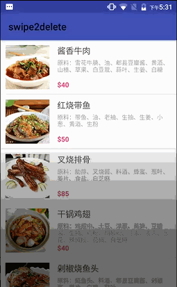

# swipe2delete
Android RecyclerView实现滑动删除item



## Core 
实现ItemTouchHelper.SimpleCallback

> getDefaultUIUtil() 将被ItemTouchHelper用于检测视图中的UI更改。我们使用这个函数将背景视图移动前景视图

> In onChildDrawOver() 当用户滑动视图时，前景视图的位置被改变.

> RecyclerItemTouchHelperListener 通知activity， swipe被触发.

```java
public class RecyclerItemTouchHelper extends ItemTouchHelper.SimpleCallback {
    private RecyclerItemTouchHelperListener listener;

    public RecyclerItemTouchHelper(int dragDirs, int swipeDirs, RecyclerItemTouchHelperListener listener) {
        super(dragDirs, swipeDirs);
        this.listener = listener;
    }

    @Override
    public boolean onMove(RecyclerView recyclerView, RecyclerView.ViewHolder viewHolder, RecyclerView.ViewHolder target) {
        return true;
    }

    @Override
    public void onSelectedChanged(RecyclerView.ViewHolder viewHolder, int actionState) {
        if (viewHolder != null) {
            final View foregroundView = ((CartListAdapter.MyViewHolder) viewHolder).viewForeground;

            getDefaultUIUtil().onSelected(foregroundView);
        }
    }

    @Override
    public void onChildDrawOver(Canvas c, RecyclerView recyclerView, RecyclerView.ViewHolder viewHolder, float dX, float dY, int actionState, boolean isCurrentlyActive) {
        final View foregroundView = ((CartListAdapter.MyViewHolder) viewHolder).viewForeground;
        getDefaultUIUtil().onDrawOver(c, recyclerView, foregroundView, dX, dY,
                actionState, isCurrentlyActive);
    }

    @Override
    public void clearView(RecyclerView recyclerView, RecyclerView.ViewHolder viewHolder) {
        final View foregroundView = ((CartListAdapter.MyViewHolder) viewHolder).viewForeground;
        getDefaultUIUtil().clearView(foregroundView);
    }

    @Override
    public void onChildDraw(Canvas c, RecyclerView recyclerView, RecyclerView.ViewHolder viewHolder, float dX, float dY, int actionState, boolean isCurrentlyActive) {
        final View foregroundView = ((CartListAdapter.MyViewHolder) viewHolder).viewForeground;

        getDefaultUIUtil().onDraw(c, recyclerView, foregroundView, dX, dY,
                actionState, isCurrentlyActive);
    }

    @Override
    public void onSwiped(RecyclerView.ViewHolder viewHolder, int direction) {
        listener.onSwiped(viewHolder, direction, viewHolder.getAdapterPosition());
    }

    public interface RecyclerItemTouchHelperListener {
        void onSwiped(RecyclerView.ViewHolder viewHolder, int direction, int position);
    }
}

```
